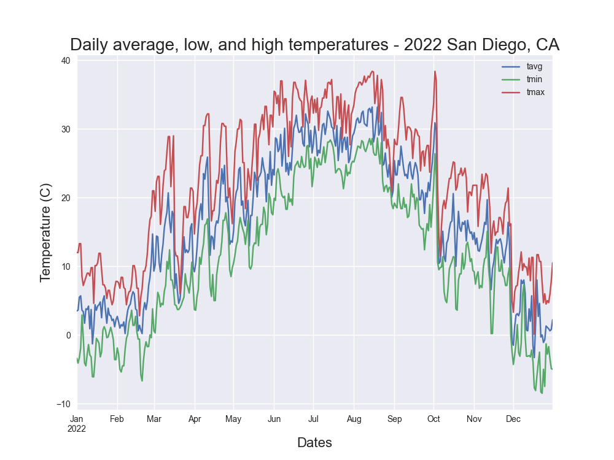
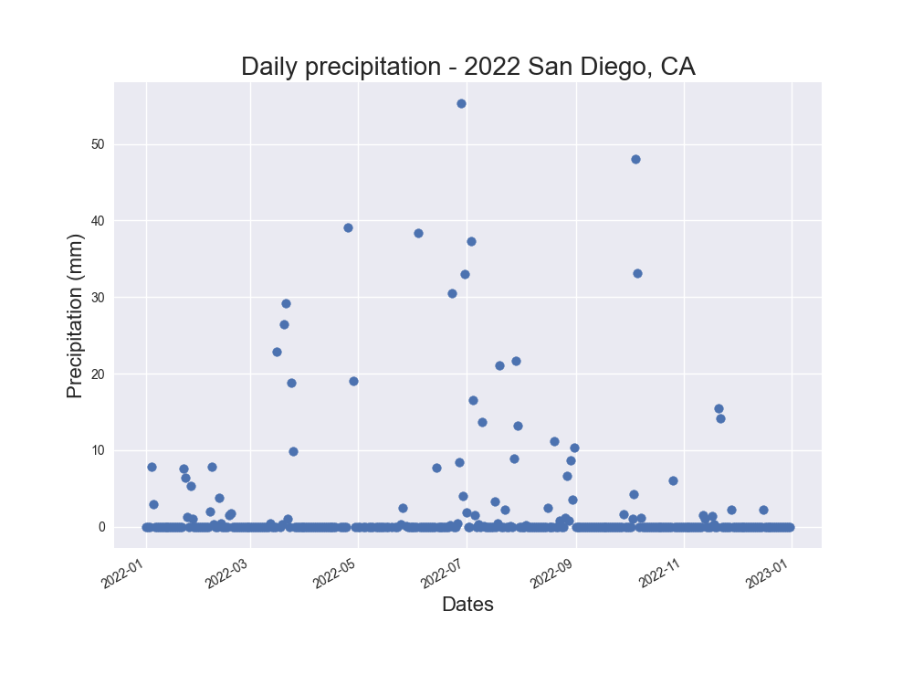

# San Diego Weather 2022

## Overview
Graphs using Meteostat's data on San Diego for the year 2022. I was investigating if there was an increasing trend in temperature in my hometown of San Diego in 2022. I also was curious to see if there was a correlation between pressure and temperature in 2022.

## Graphs

| Files | Description |
| ----- | ----------- |
| `san_diego_lows_averages_highs.py` | I plotted a line chart showing daily minimum, average, and maximum temperature |
| `san_diego_lows.py` `san_diego_averages.py` `san_diego_highs.py` | I plotted a line chart showing daily minimum, average, and maximum temperature respectively and a trendline |
| `san_diego_precipitation.py` | I plotted the daily precipitation |
| `san_diego_pressure.py` | I plotted the daily pressure |
| `san_diego_avg_temp_vs_pressure.py` | I plotted the pressure on the x axis versus the temperature on the y axis  I plotted the regression line and calculated the correlation coefficent and p-value |

### Daily Minimum, Average, and Maximum Temperature

### Daily Minimum Temperature

### Daily Average Temperature

### Daily Maximum Temperature

### Daily Precipitation

### Daily Pressure

### Daily Average Temperature Versus Daily Pressure 

